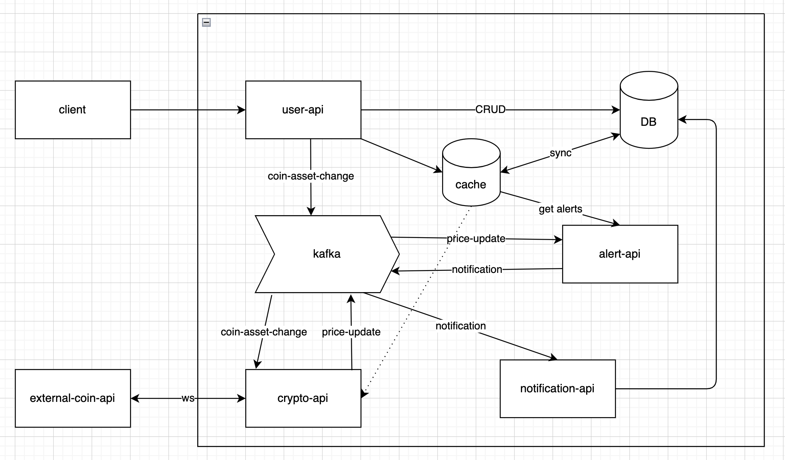

# Crypto Alert System

## Overview
This project is a microservices-based cryptocurrency alert system that monitors real-time price changes and notifies users when their alert conditions are met. The system leverages Kafka, Redis, MongoDB, and WebSocket for scalability and efficiency.

## Architecture
The system consists of the following microservices:
- **User API**: Manages user authentication, alert creation and notification display.
- **Crypto API**: Subscribes to CoinAPI WebSocket, retrieves real-time prices, and publishes them to Kafka.
- **Alert API**: Consumes price updates from Kafka, checks alerts, and triggers notifications.
- **Notification API**: Consumes triggered notifications and stores them in MongoDB for users to retrieve.



**Technologies Used:**
- **Node.js, Express**: Backend services
- **Kafka (Bitnami Helm Chart)**: Event-driven architecture
- **Redis**: Caching active alerts
- **MongoDB**: Persistent data storage
- **Docker, Kubernetes (Minikube)**: Containerized deployment
- **Swagger**: API documentation

## Setup Instructions

### Prerequisites
Ensure you have the following installed:
- [Docker](https://docs.docker.com/get-docker/)
- [Minikube](https://minikube.sigs.k8s.io/docs/start/)
- [Kubectl](https://kubernetes.io/docs/tasks/tools/)
- [Helm](https://helm.sh/docs/intro/install/)

Get COIN_API_KEY from [Coin API](https://www.coinapi.io/)

### Installation
1. **Clone the repository**:
   ```sh
   git clone https://github.com/dedekoymert/crypto-price-alert.git
   cd crypto-alert-system
   ```

2. **Set environment variables**:
   For the simplecity secrets are given from environment variables inside **/-deployment.yaml files. Only add COIN_API_KEY for k8s/crypto-api-deployment.yaml and k8s/user-api-deployment.yaml.

3. **Build and deploy the services**
    ```sh
    eval $(minikube docker-env)

    # Deploy Kafka
    helm install crypto-alert-kafka bitnami/kafka -n kafka --create-namespace -f k8s/kafka/values.yaml

    # Build microservices
    docker build --no-cache -t user-api -f user-api/Dockerfile .
    docker build --no-cache -t crypto-api -f crypto-api/Dockerfile .
    docker build --no-cache -t alert-api -f alert-api/Dockerfile .
    docker build --no-cache -t notification-api -f notification-api/Dockerfile .

    # Deploy microservices
    kubectl apply -f k8s/redis-deployment.yaml
    kubectl apply -f k8s/mongodb-deployment.yaml
    kubectl apply -f k8s/user-api-deployment.yaml
    kubectl apply -f k8s/crypto-api-deployment.yaml
    kubectl apply -f k8s/alert-api-deployment.yaml
    kubectl apply -f k8s/notification-api-deployment.yaml
    ```

## API Documentation

### Swagger Setup
Get url for user-api-service
```sh
minikube service user-api-service --url
```
Reach exposed Swagger documentation at `{EXPOSED_URL}/api-docs`.
